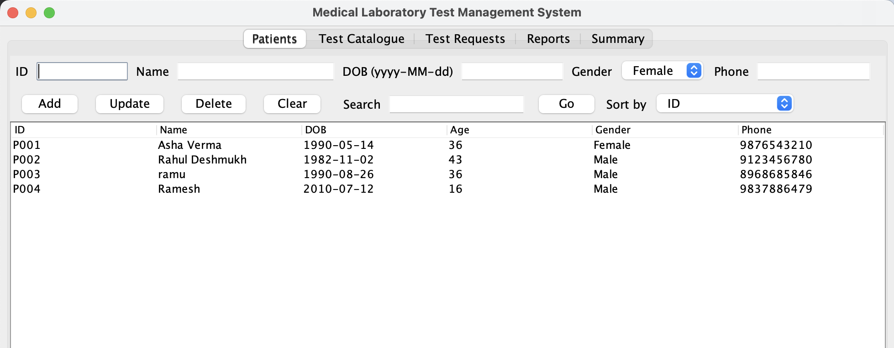
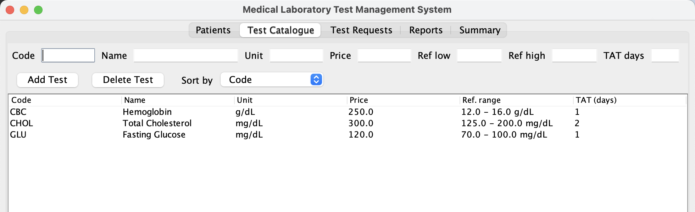
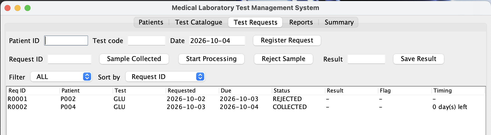
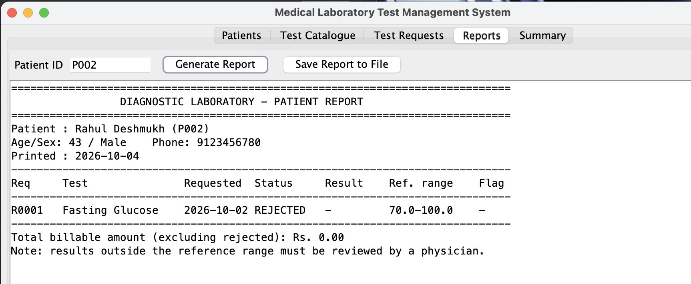
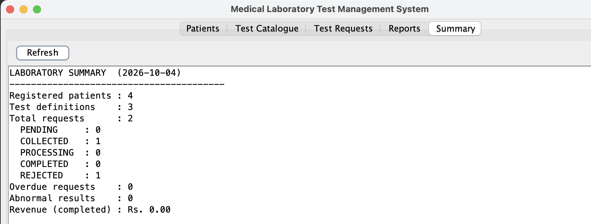

# Medical Laboratory Test Management System
 
A desktop application for a diagnostic laboratory, written in **Java (Swing)**. It manages patients, the test catalogue, and test requests from sample registration through to result entry, and it enforces the lab's business rules in code. Data is stored in plain CSV files, so no database setup is needed.
 
## Screenshots
 
> Add your screenshots to an `images/` folder and update the file names below.
 
| Patients | Test Catalogue |
|---|---|
|  |  |
 
| Test Requests | Reports |
|---|---|
|  |  |
 
| Summary |
|---|
|  |
 
## Features
 
- **Patient management**: add, update, delete, search (by ID, name or phone) and sort patients. Age is calculated from the date of birth.
- **Test catalogue**: define tests with code, name, unit, price, reference range (low and high) and turnaround time in days.
- **Test requests**: register a request for a patient and test. The due date is calculated automatically (request date + turnaround days).
- **Sample life cycle**: `PENDING` → `COLLECTED` → `PROCESSING` → `COMPLETED`, with `REJECTED` possible before completion.
- **Result entry and flagging**: results are compared with the reference range and flagged `LOW`, `NORMAL` or `HIGH`.
- **Overdue tracking**: the requests table shows days left or how long a request is overdue.
- **Reports**: generate a per-patient report and save it as a text file.
- **Summary dashboard**: counts by status, overdue requests, abnormal results and revenue from completed tests.
- **Persistence**: data is loaded on start and saved when the window is closed.
## Business rules
 
| Area | Rule |
|---|---|
| IDs | Patient IDs and test codes must be unique (stored in upper case). |
| Deletion | A patient or test that has test requests cannot be deleted. |
| Duplicates | The same patient, test and date cannot be requested twice, unless the earlier request was rejected. |
| Dates | Request date cannot be in the past. Date of birth cannot be in the future or more than 130 years ago. |
| Status flow | Only valid transitions are allowed. `COMPLETED` and `REJECTED` are final. |
| Results | A result can be entered only while the request is `PROCESSING`. Entering it sets the status to `COMPLETED`. Results cannot be negative. |
| Validation | Name: letters, spaces, `.`, `'`, `-` (2 to 60 characters). Phone: exactly 10 digits. Price: greater than 0. Reference low must be less than high. Turnaround: 0 to 30 days. |
| Billing | Reports total the price of all tests except rejected ones. |
 
## Sample status flow
 
```
PENDING ──► COLLECTED ──► PROCESSING ──► COMPLETED
   │            │              │
   └────────────┴──────────────┴──────► REJECTED
```
 
## Design
 
The code follows a layered design:
 
| Layer | Classes | Responsibility |
|---|---|---|
| GUI | `MainFrame` | Collects input, calls the service, shows messages. Contains no business rules. |
| Service | `LabService` | All validation, business rules, sorting, reports and file I/O. |
| Model | `Patient`, `TestDefinition`, `TestRequest`, `SampleStatus` | Data and simple behaviour (for example `SampleStatus.canMoveTo`). |
| Error handling | `LabException` | Checked exception that carries rule messages to the GUI. |
 
Java features used: collections (`LinkedHashMap`, `ArrayList`, `EnumMap`), `Comparator` maps for sorting, streams and lambdas, enums with behaviour, `java.time.LocalDate`, `java.nio.file` with try-with-resources, and Swing (`JTabbedPane`, `JTable`, `DefaultTableModel`).
 
## Requirements
 
- **Java 11 or later** (uses `String.isBlank()` and `String.repeat()`)
- A desktop environment (Swing GUI)
## How to run
 
```bash
# compile
javac LabManagementSystem.java
 
# run
java LabManagementSystem
```
 
Or open the file in an IDE such as NetBeans, IntelliJ IDEA or Eclipse and run the `main` method.
 
On the first run, if no data exists, the app loads sample data:
 
- Patients: `P001` Asha Verma, `P002` Rahul Deshmukh
- Tests: `CBC` (Hemoglobin), `GLU` (Fasting Glucose), `CHOL` (Total Cholesterol)
## How to use
 
1. **Patients tab**: add a patient (ID, name, DOB as `yyyy-MM-dd`, gender, 10-digit phone). Click a row to load it into the form for update or delete.
2. **Test Catalogue tab**: add tests with price, reference range and turnaround days.
3. **Test Requests tab**: enter patient ID, test code and date, then click **Register Request**. Select the request and move it through **Sample Collected** → **Start Processing**, then enter the **Result** and click **Save Result**.
4. **Reports tab**: enter a patient ID, click **Generate Report**, then optionally **Save Report to File**.
5. **Summary tab**: click **Refresh** to see lab statistics.
Closing the window saves all data automatically.
 
## Data files
 
Everything is stored in a `labdata/` folder created next to where you run the program.
 
| File | Columns |
|---|---|
| `patients.csv` | id, name, dob, gender, phone |
| `tests.csv` | code, name, unit, price, refLow, refHigh, turnaroundDays |
| `requests.csv` | id, patientId, testCode, requestDate, dueDate, status, result, resultDate |
| `report_<ID>_<date>.txt` | Saved patient reports |
 
Commas inside text fields are replaced with spaces when saving. If a data file is corrupted, the app shows a message and starts with sample data.
 
## Project structure
 
```
.
├── LabManagementSystem.java   # entire application (model, service, GUI)
├── labdata/                   # created at runtime (CSV data and saved reports)
├── images/                    # your screenshots
└── README.md
```
 

## Author
 
Gaurav Patel
 